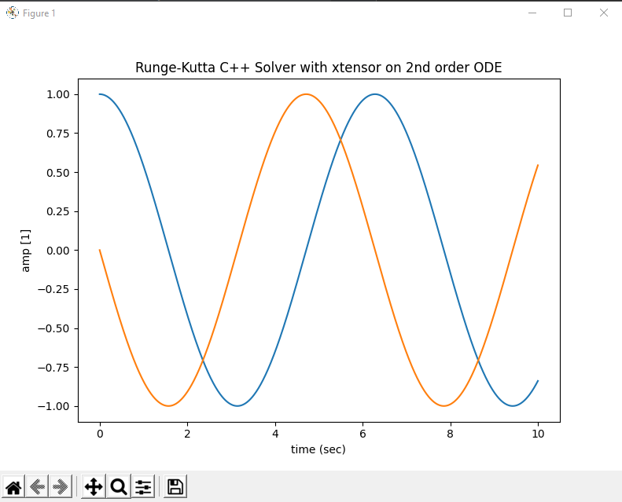

# gsrurface-csolver

This library aims to provide a efficient way to solve gsurface (python) models.
 
*gsurface* (python) library is not yet released (GPL v3).

Written in C++ and based on xtensor, it is much faster and more efficient that the native gsurface python solver.

**Concept**
```
   [gsurface python]       [universal json]            [gsurface-csover]          [universal npy]    [gsurface python]
  create model --(export)--> model.json --(import)--> gsurface-csolver solve --(save)--> states.npy --> plot
```

**Native**

All in *gsurface* python
```
create model > solve > plot + export .npy + export .json
```

